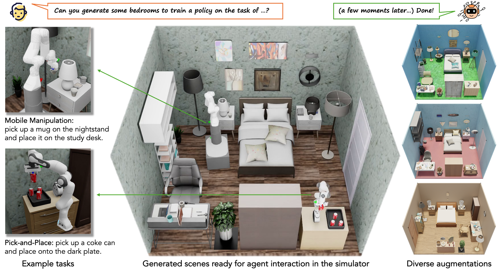

# SAGE: Scalable Agentic 3D Scene Generation for Embodied AI

**Hongchi Xia**, **Xuan Li**, **Zhaoshuo Li**, **Qianli Ma**, **Jiashu Xu**, **Ming-Yu Liu**, **Yin Cui**, **Tsung-Yi Lin**, **Wei-Chiu Ma**, **Shenlong Wang**, **Shuran Song**, **Fangyin Wei**

*NVIDIA, University of Illinois Urbana-Champaign, Cornell University, Stanford University*

[](https://drive.google.com/file/d/1j_jmcn2hAEQqG1fBiiW4G0hSdRPzR3co/view?usp=sharing)
[](https://research-staging.nvidia.com/labs/dir/sage/)
[](https://huggingface.co/datasets/nvidia/SAGE-10k)



## Intro
SAGE is an agentic framework that, given a user-specified embodied task, understands the intent and automatically generates simulation-ready environments at scale. Here we release both 3D scene and action generation code, as well as the agentic-generated SAGE-10k dataset to foster further research.

## SAGE-10k Dataset

[](https://huggingface.co/datasets/nvidia/SAGE-10k)

[SAGE-10k](https://huggingface.co/datasets/nvidia/SAGE-10k) is a large-scale interactive indoor scene dataset featuring realistic layouts, generated by the agentic-driven pipeline introduced in "SAGE: Scalable Agentic 3D Scene Generation for Embodied AI". The dataset contains 10,000 diverse scenes spanning 50 room types and styles, along with 565K uniquely generated 3D objects.

## Acknowledgements

We gratefully acknowledge the authors of the following projects for their foundational work and open-source contributions. This repository builds upon and adapts components from:

Modifications have been made to the following components, which remain subject to their original licenses:

| Repository | License |
|------------|---------|
| [isaac-sim/IsaacLab](https://github.com/isaac-sim/IsaacLab) | [BSD-3-Clause](https://github.com/isaac-sim/IsaacLab/blob/main/LICENSE) |
| [NVlabs/M2T2](https://github.com/NVlabs/M2T2) | [NVIDIA License](https://github.com/NVlabs/M2T2/blob/master/LICENSE) |
| [giuvecchio/matfuse-sd](https://github.com/giuvecchio/matfuse-sd) | [MIT License](https://github.com/giuvecchio/matfuse-sd/blob/main/LICENSE) |
| [ARISE-Initiative/robomimic](https://github.com/ARISE-Initiative/robomimic) | [MIT License](https://github.com/ARISE-Initiative/robomimic/blob/master/LICENSE) |

Additionally, our implementation of the MCP client and server draws inspiration and references from:

| Repository | License |
|------------|---------|
| [allenai/Holodeck](https://github.com/allenai/Holodeck) | [Apache 2.0](https://github.com/allenai/Holodeck/blob/main/LICENSE) |
| [xiahongchi/HoloScene](https://github.com/xiahongchi/HoloScene) | [Apache 2.0](https://github.com/xiahongchi/HoloScene/blob/master/LICENSE.txt) |
| [microsoft/TRELLIS](https://github.com/microsoft/TRELLIS) | [MIT License](https://github.com/microsoft/TRELLIS/blob/main/LICENSE) |
| [black-forest-labs/flux](https://github.com/black-forest-labs/flux) | [Apache 2.0](https://github.com/black-forest-labs/flux/blob/main/LICENSE) |
| [QwenLM/Qwen3](https://github.com/QwenLM/Qwen3) | [Apache 2.0](https://github.com/QwenLM/Qwen3?tab=readme-ov-file#license-agreement) |

## Directory Structure

The repository is organized into the following main components:

- **`client/`**
  Contains the client-side implementation and scripts. This is the primary entry point for users to initiate scene generation, control the pipeline, and interface with NVIDIA Isaac Sim.

- **`server/`**
  Hosts the core backend logic. This includes integrations with Foundation Models (LLMs, VLMs), 3D asset generation (TRELLIS), material synthesis, and the scene layout solvers.

- **`IsaacLab/`**  
  Integration with **NVIDIA Isaac Lab**, providing the simulation environment for robot learning and physical interaction tasks.  
  > **Note:** This directory contains modifications to the original code and remains subject to the original [BSD-3-Clause License](https://github.com/isaac-sim/IsaacLab/blob/main/LICENSE).

- **`M2T2/`**  
  Integration with **M2T2**, utilized for generating contact-rich manipulation data and handling complex robot-object interactions.  
  > **Note:** This directory contains modifications to the original code and remains subject to the original [NVIDIA License](https://github.com/NVlabs/M2T2/blob/master/LICENSE).

- **`matfuse-sd/`**  
  Integration with **MatFuse** material generation engine, used to generate high-quality textures and materials for 3D objects and scenes.  
  > **Note:** This directory contains modifications to the original code and remains subject to the original [MIT License](https://github.com/giuvecchio/matfuse-sd/blob/main/LICENSE).

- **`robomimic/`**  
  Integration with **robomimic**, a framework for robot policy learning from demonstration, used for training policies on generated data.  
  > **Note:** This directory contains modifications to the original code and remains subject to the original [MIT License](https://github.com/ARISE-Initiative/robomimic/blob/master/LICENSE).

## Getting Started

To use this repository, you will need to set up both the server (backend) and the client (frontend/interface). Please refer to the respective README files for detailed instructions.

### 1. Server Setup
**[Read the Server Documentation](server/README.md)**
  - Setup instructions for the backend infrastructure.
  - Hosting details for VLM (Qwen), LLM (GPT), and 3D generation models (TRELLIS).
  - Guides for running augmentation pipelines.

### 2. Client Setup
**[Read the Client Documentation](client/README.md)**
  - Installation of the Python environment and dependencies.
  - Instructions for installing and linking NVIDIA Isaac Sim.
  - Scripts for running scene generation, robot task generation, and visualization.

### Usage Workflow
1.  **Start the Backend**: Ensure all model servers (LLM, VLM, TRELLIS) are running as described in the Server README.
2.  **Configure the Client**: Set up your `key.json` and environment variables in the Client directory.
3.  **Run Generation**: Use the scripts in `client/scripts/` to generate scenes (e.g., `generate_from_room_desc.sh`) or robot data.

## Citation

If you find our work useful in your research, please consider citing:

```bibtex
@article{xia2025sage,
  title={SAGE: Scalable Agentic 3D Scene Generation for Embodied AI},
  author={Xia, Hongchi and Li, Xuan and Li, Zhaoshuo and Ma, Qianli and Xu, Jiashu and Liu, Ming-Yu and Cui, Yin and Lin, Tsung-Yi and Ma, Wei-Chiu and Wang, Shenlong and Song, Shuran and Wei, Fangyin},
  journal={arXiv preprint arXiv:TBD},
  year={2025}
}
```
